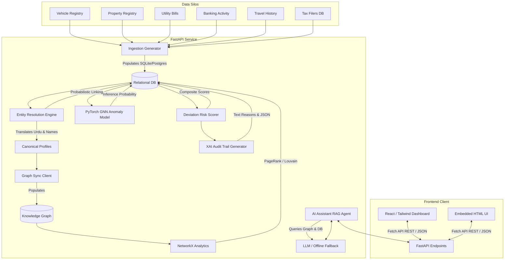
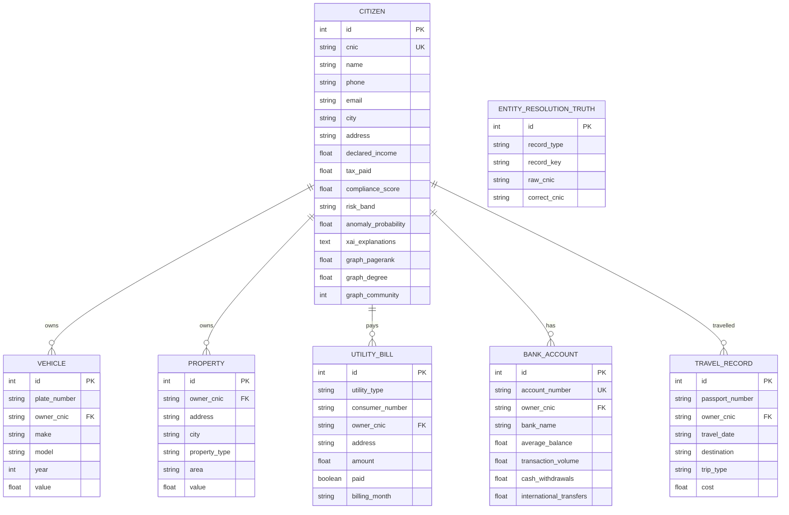
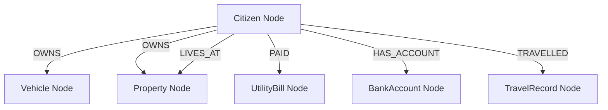

# Graph AI for Broadening the National Tax Net

A production-ready FBR Pakistan tax intelligence platform that merges separate registry silos (vehicles, property deeds, bank portfolios, travel history, and utilities), resolves fragmented identity records, builds a Knowledge Graph, and employs a Graph Neural Network (GNN) to uncover tax evasion and under-reporting.

---

## 1. System Architecture Diagram



---

## 2. Relational Entity-Relationship (ER) Schema



---

## 3. Knowledge Graph Schema

Nodes are linked through explicit ownership, billing, banking, and travel relationships.



---

## 4. Graph Neural Network (GNN) Anomaly Detection

To capture complex neighborhood associations (e.g. citizens sharing phone numbers, utility bills, or bank details to hide assets), we implement a **Graph Convolutional Network (GCN)** using pure PyTorch.

### Node Feature Design (8 Dimensions):
$$\mathbf{x}_i = \begin{bmatrix}
\text{Declared Income} \\
\text{Tax Paid} \\
\text{Total Registered Asset Value} \\
\text{Average Monthly Utility Consumption} \\
\text{International Travel Outlays} \\
\text{Banking Transaction Volume} \\
\text{PageRank Centrality} \\
\text{Degree Centrality}
\end{bmatrix}$$

### Graph Convolution Equation:
$$Z^{(l+1)} = \sigma \left( \tilde{D}^{-1/2} \tilde{A} \tilde{D}^{-1/2} Z^{(l)} W^{(l)} \right)$$

Where:
* $\tilde{A} = A + I_N$ (Adjacency matrix augmented with self-loops, preventing node feature washing).
* $\tilde{D}$ is the diagonal degree matrix of $\tilde{A}$ where $\tilde{D}_{ii} = \sum_{j} \tilde{A}_{ij}$.
* $W^{(l)}$ is the layer weight matrix.
* $\sigma$ represents the ReLU activation function, and the final layer uses Sigmoid to output an anomaly probability: $p_i \in [0.0, 1.0]$.

---

## 5. Entity Resolution Model

Our Entity Resolution (ER) Engine resolves variations in CNICs, spelling errors, and bilingual name formats.

### Probabilistic Matching Formula:
$$\text{Confidence} = w_C \cdot S_{\text{CNIC}} + w_N \cdot S_{\text{Name}} + w_A \cdot S_{\text{Address}} + w_P \cdot S_{\text{Phone}}$$

* **CNIC Distance ($S_{\text{CNIC}}$)**: Standard Levenshtein metric of cleaned digits. Direct matches yield 1.0.
* **Name Distance ($S_{\text{Name}}$)**: Token Sort Fuzzy Ratio. Standardizes Urdu-transliterated text (e.g. "محمد علی" $\to$ "Muhammad Ali").
* **Address Cosine ($S_{\text{Address}}$)**: Substring n-gram TF-IDF vector similarity.

---

## 6. Risk Scoring Formula

We calculate a rule-based **Tax Compliance Deviation Score** to contrast taxpayer lifestyle indicators with declared tax records:

$$\text{Risk Score} = \text{clip} \left( 0.20 \cdot S_{\text{Vehicle}} + 0.25 \cdot S_{\text{Property}} + 0.20 \cdot S_{\text{Utility}} + 0.15 \cdot S_{\text{Travel}} + 0.10 \cdot S_{\text{Bank}} - 0.10 \cdot S_{\text{Income}} + \text{BaseNonFilerRisk}, 0, 100 \right)$$

* **$S_{\text{Vehicle}}$**: Normalized value of vehicles owned (cap: PKR 25M).
* **$S_{\text{Property}}$**: Normalized value of property deeds (cap: PKR 80M).
* **$S_{\text{Utility}}$**: Annual utilities paid (cap: PKR 800k).
* **$S_{\text{Travel}}$**: Annual international flights cost (cap: PKR 3M).
* **$S_{\text{Bank}}$**: Average bank balances (cap: PKR 30M).
* **$S_{\text{Income}}$**: declared income reducing risk offsets (cap: PKR 12M).
* **$\text{BaseNonFilerRisk}$**: Added default penalty of $+15$ points for tax non-filers.

---

## 7. Deploy & Setup Instructions

### Prerequisites
* **Python**: `3.10` up to `3.14`
* **Docker & Docker Compose** (Optional: for cluster orchestration)

---

### Option A: Run Locally (Fastest & Lightest)

The application includes an in-memory/disk database using **SQLite** and **NetworkX** and serves an **embedded web dashboard UI** directly on port `8000`, bypassing the need for Node/npm or local Docker.

1. **Move into backend directory**:
   ```bash
   cd backend
   ```

2. **Install requirements**:
   ```bash
   pip install -r requirements.txt
   ```

3. **Run Backend Server**:
   ```bash
   uvicorn app.main:app --host 127.0.0.1 --port 8000 --reload
   ```

4. **Access UI**:
   Open [http://localhost:8000/](http://localhost:8000/) in your web browser.
   
5. **Load Data**:
   Click the **Execute Pipeline** button in the header of the UI to generate the synthetic dataset (10,000 citizens, 50,000 bills), perform entity resolution, and run the GNN training.

---

### Option B: Deploy in Docker Cluster (Enterprise Mode)

Deploys PostgreSQL, Neo4j, FastAPI, and a React web server.

1. **Navigate to the root directory**:
   ```bash
   cd c:/Users/Hp/OneDrive/Desktop/app.py
   ```

2. **Start Docker Compose**:
   ```bash
   docker-compose up --build
   ```

3. **Access Services**:
   * **React Dashboard**: [http://localhost:3000/](http://localhost:3000/)
   * **FastAPI documentation**: [http://localhost:8000/docs/](http://localhost:8000/docs/)
   * **Neo4j Console**: [http://localhost:7474/](http://localhost:7474/) (User: `neo4j`, Password: `password`)

---

## 8. API Endpoint Documentation

| Method | Endpoint | Description |
|--------|----------|-------------|
| **POST** | `/api/v1/system/run-pipeline` | Triggers synthetic generator, entity resolver, NetworkX analytics, and GNN training. |
| **GET** | `/api/v1/taxpayers/search?query=...` | Search taxpayers by name or CNIC. |
| **GET** | `/api/v1/taxpayers/{cnic}` | Fetches complete taxpayer profile (vehicles, land, bank, travel, and XAI sheet). |
| **GET** | `/api/v1/taxpayers/{cnic}/graph` | Serves Cytoscape-compatible neighborhood node-link JSON payload. |
| **GET** | `/api/v1/taxpayers/ranking` | Returns rankings sorted by Compliance Deviation. |
| **GET** | `/api/v1/analytics/stats` | Returns aggregated statistics (filer count, risk band distributions). |
| **GET** | `/api/v1/analytics/metrics` | Returns precision, recall, and ROC-AUC numbers for the GNN and ER engine. |
| **POST** | `/api/v1/chat` | AI RAG Chat Assistant query endpoint. |
